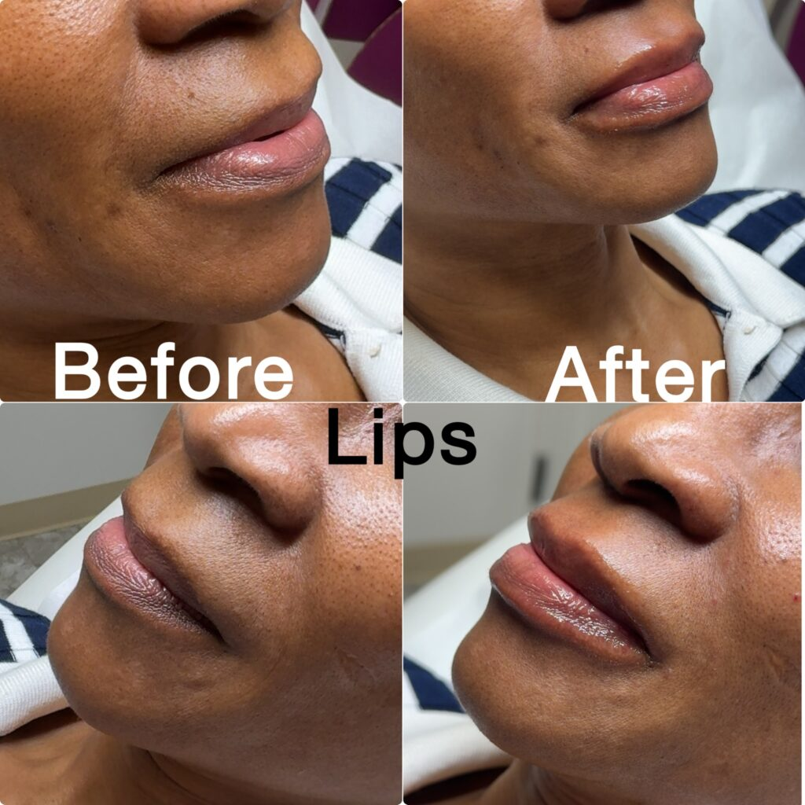

# What Is the Difference Between a Lip Flip and Lip Filler?

If you want a fuller-looking upper lip, a lip flip and lip filler can sound like two names for the same treatment. They work differently: a lip flip changes muscle activity, while filler adds volume.

The useful question is what makes your lips look smaller than you would like. At Estar MedSpa & Innovative Health Center in Olney, MD, both treatments are listed services, so you can compare the options against your goal rather than choose from a name alone.

## What Does a Lip Flip Actually Do?

A lip flip uses small botulinum toxin injections around the upper lip to relax muscle activity. This can allow more of the upper lip to show, especially when it curls inward during a smile.

It does not add tissue or gel. If your main concern is a lack of volume while your face is at rest, changing muscle activity may not provide the fullness you want.

Estar's [Botox lip flip service](https://estarmedspa.com/services/botox-lip-flip-olney-maryland/) describes this as a muscle-relaxing approach rather than an increase in lip size. That distinction matters more than a general promise that one option looks more natural.

A lip flip is an off-label use of Botox Cosmetic. Ask the injector to explain that use, its expected effect, and its risks before deciding.

## How Does Lip Filler Work Differently?

Lip filler places an injectable material into selected areas of the lips to add volume or alter shape. Hyaluronic acid gels are commonly used for this purpose.

Filler can address fullness at rest, definition, or some differences between the upper and lower lips. It is not a guarantee of perfect symmetry or a replacement for assessment of your natural anatomy.

Estar's [lip filler page](https://estarmedspa.com/services/lip-filler-in-olney-maryland/) describes goals including volume, reshaping, and balancing the lips. If you want to keep your current size but change how your upper lip shows when smiling, explain that before assuming filler is the better choice.

Both approaches can produce a subtle result. The amount, placement, and suitability matter; filler does not automatically mean oversized lips, and a lip flip does not automatically mean the right result.

## Which Concern Points Toward Which Treatment?

Think about your lips at rest and in motion. A mirror or a few clear photos can help you describe the difference to the injector.

- If your upper lip rolls inward when you smile, ask about muscle activity and whether a lip flip could help.
- If you want more volume even when relaxed, ask how filler might address that goal.
- If your main concern is shape or upper-to-lower lip balance, discuss what filler can realistically change.
- If you want several changes, separate them so the proposed treatment has a clear purpose.

These are starting points for discussion, not a diagnosis. A change that sounds similar on paper can have different causes in different faces.

You can also decide against treatment. A useful assessment should make the likely benefit and tradeoffs clear enough for you to make that choice.

## What Can Estar's Own Lip Examples Show You?

Estar's [published gallery](https://estarmedspa.com/before-and-afters/) includes a lip-filler example with before-and-after views from more than one angle. It gives you a specific practice example to discuss instead of relying only on general descriptions.

*Caption: Lip-filler example from Estar's before-and-after gallery. The source does not identify the product, amount, treating clinician, or time between photographs. Individual results vary.*

The example shows the lips at rest, so it addresses a different visual question from whether an upper lip disappears during a smile. Ask to see relevant views when comparing your goal with a treatment example.

The gallery also has a category combining PDO threads and a Botox lip flip. A combined-treatment example cannot show what a lip flip alone achieved, so do not use it as a direct comparison with filler alone.

## When Will You See Results, and How Long Do They Last?

A lip flip takes time to develop. Estar describes a change within the first week, with the full effect taking about 10 to 14 days.

Its lip flip page gives an average duration of three to four months. That is a practice estimate, not a promise; muscle response and treatment details can change how long the effect lasts.

Filler adds volume immediately, but swelling can distort the early appearance. Give recovery time before deciding whether the amount or shape matches your goal.

Estar describes lip filler lasting roughly six to 12 months, depending on the product. Other clinical guidance gives longer ranges for some patients, which is why a personal product discussion is more useful than treating one number as universal.

Neither treatment is permanent. Compare the expected benefit, recovery, and maintenance together rather than choosing only the option with the longest advertised duration.

## What Are the Important Risks?

Both involve injections and can cause bruising, swelling, or tenderness. Their more serious risks differ because they act in different ways.

With a lip flip, too much muscle relaxation can affect drinking, speaking, or keeping the lips closed. The effect cannot simply be dissolved; it must wear off.

[Cleveland Clinic's lip flip guidance](https://my.clevelandclinic.org/health/treatments/22362-lip-flip) describes these functional tradeoffs. Tell the injector if you play a wind instrument, sing, or have another activity that makes fine lip control important to you.

Filler can rarely enter or block a blood vessel. The [FDA's filler guidance](https://www.fda.gov/medical-devices/aesthetic-cosmetic-devices/dermal-fillers-soft-tissue-fillers) warns that this can cause tissue injury, vision loss, or stroke.

Seek immediate medical attention for unusual pain, vision changes, or white, gray, or blue skin near a filler injection. Difficulty breathing or swallowing after botulinum toxin treatment also needs urgent medical attention.

## What Is the Appointment Experience at Estar?

Estar's lip filler page describes topical numbing before injections and a short observation period afterward. Its lip flip page says numbing or a cold compress may be used for comfort and describes monitoring after treatment.

Those details help with scheduling, but they do not guarantee a painless appointment. Allow time for assessment and preparation rather than planning only for the injections.

Share your medicines, allergies, previous injectables, cold-sore history, and relevant medical conditions. Mention pregnancy or breastfeeding before any elective treatment decision.

Estar lists Nana Mensah as an aesthetic nurse practitioner and Dr. Mimi P. Martins as medical director. Confirm who will assess and perform your particular treatment rather than assuming the practice's general team listing assigns every procedure to either person.

## How Should You Compare the Cost?

Ask for a quote for the specific treatment proposed, then consider maintenance as well as the first visit. A smaller initial bill is not necessarily a lower cost over the period you want to maintain the result.

Find out whether the quote includes assessment, the selected product or amount, and a review visit. Ask separately about the terms for adjustments; do not assume that every follow-up treatment is included.

Compare plans that address the same goal. Paying less for a lip flip does not help if you wanted added volume that the treatment cannot provide.

## Can the Two Treatments Be Combined?

Sometimes the goals involve both volume and muscle movement. Combining treatments may be discussed, but it should answer a specific need rather than be an automatic package.

Estar also offers [facial balancing](https://estarmedspa.com/services/facial-balancing-treatments-olney-maryland/). If your concern involves overall proportions, ask how the lip plan relates to your face without assuming that more treatment areas are necessary.

## Compare Your Options in Olney, MD

Bring a clear description of what you want to change at rest and when smiling. Ask which option addresses that concern and what recovery and maintenance would involve.

[Contact Estar MedSpa](https://estarmedspa.com/contact/) or call 301-917-3870 to arrange a consultation at its Olney location and confirm the appropriate appointment.
