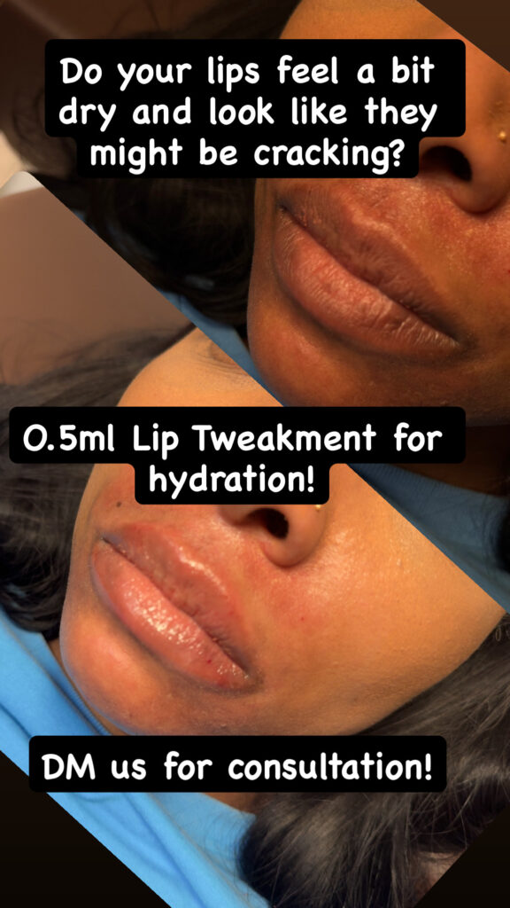

# What Is the Difference Between a Lip Flip and Lip Filler?

A lip flip changes how the upper lip sits; lip filler adds volume. Both can make lips look fuller, but they address different reasons for wanting that change. The better choice depends on whether the concern is upper-lip movement, a lack of fullness, or both.

At Estar MedSpa & Innovative Health Center in Olney, MD, a [Botox lip flip](https://estarmedspa.com/services/botox-lip-flip-olney-maryland/) offers a muscle-relaxing approach to showing more of the upper lip. Filler serves a different purpose. Understanding that distinction is more useful than choosing whichever treatment sounds subtler or costs less at the first appointment.

## What Does a Lip Flip Change?

A lip flip uses a small amount of botulinum toxin to relax muscle around the upper lip. This can allow more of the lip to show without adding material to it. The apparent increase in fullness comes from a change in position rather than an increase in volume.

That makes upper-lip movement relevant to the decision. If your upper lip becomes less visible when you smile, a lip flip may be worth considering. If your main concern is a thin lower lip or wanting fuller lips at rest, the same approach does not supply the missing volume.

[Cleveland Clinic's lip-flip explanation](https://my.clevelandclinic.org/health/treatments/22362-lip-flip) describes this muscle-relaxing effect and its limits. A lip flip can make a small visual change, but “small” does not mean that everyone will like it or that it is the right treatment for every subtle goal.

Consider the upper and lower lip separately, as well as the lips at rest and in a smile. A concern limited to upper-lip visibility calls for a different explanation from a request for more fullness across both lips. Describing those differences gives the clinician a clearer question to assess.

The useful consultation question is what is creating the appearance you want to change. A recommendation should connect that finding with the treatment's mechanism. Otherwise, two procedures that both promise fuller-looking lips can seem interchangeable when they are not.

## What Does Lip Filler Change?

Lip filler places material in the lips to add volume and influence shape or definition. Hyaluronic acid is a common filler material. The amount and placement affect the proposed change, so filler does not have to mean a large increase in size.

Estar's [dermal filler options](https://estarmedspa.com/services/dermal-fillers-olney-maryland/) include Juvéderm Ultra XC for lip enhancement. Its broader filler range also serves other facial concerns. A filler used elsewhere on the face is not automatically the product intended for your lips.

For someone who wants more fullness even when the face is relaxed, filler may address the concern more directly than a lip flip. Someone seeking a clearer upper-lip outline may also have a different plan from someone wanting both lips enlarged. The product name alone does not explain either recommendation.

[Cleveland Clinic's lip-filler overview](https://my.clevelandclinic.org/health/treatments/22133-lip-fillers) explains how filler can increase volume and change lip shape. Individual anatomy and the intended result still guide suitability. The choice is about the change needed, not a rule that one treatment always looks more natural.

## Can Filler Produce a Modest Change?

Estar's [lip-filler gallery](https://estarmedspa.com/before-and-afters/) includes an example labeled as a 0.5 mL treatment. The paired images show a change in fullness without the large increase in size that some people associate with filler. This is a useful counterpoint to choosing a lip flip solely to avoid a dramatic look.

*Caption: A modest increase in fullness in Estar's 0.5 mL lip-filler example. Individual results vary.*

The example does not establish what amount you need. It shows that the discussion can include degree of change, not just a choice between “filler” and “no filler.” Your own treatment may require a different amount or approach, or may not be appropriate.

When comparing the options, separate the concern from the size of the result. Wanting a subtle change is a preference; whether movement or volume is responsible for the appearance is a clinical question. Both need to be understood before deciding which treatment fits.

## How Soon Will You See a Settled Result?

A lip flip takes time to develop. Estar advises allowing 10 to 14 days for the full effect, so an appointment immediately before an event may not give you the result you expect on the day. The change is gradual rather than immediate added volume.

Filler can make the lips look fuller straight away, but swelling can distort that first appearance. The early result should not be treated as the final shape or size. Allow time for recovery before judging whether the change meets your goal.

The distinction matters when planning treatment. An immediate visible change and an immediate finished result are different things. Choosing filler because it looks faster does not remove the need to plan around swelling or bruising.

Estar's lip-flip appointment includes observation for about 15 minutes after the injections. That is time for monitoring an immediate response, not time for seeing the final cosmetic effect. The treatment can be brief while the result still takes days to develop.

For either treatment, establish when the team expects you to assess the result and how concerns will be handled. Follow the instructions for your procedure rather than assume that a lip flip and filler have identical aftercare. Personal recovery can vary even when the appointment itself is brief.

## How Do Duration and Risks Compare?

Estar gives a three- to four-month estimate for a lip flip. Lip filler generally lasts longer, although the product, amount, and individual response affect its duration. Both treatments are temporary, and maintaining the appearance involves a separate decision about further treatment.

Duration also changes the financial comparison. A lower initial price does not necessarily mean a lower long-term commitment if appointments are more frequent. Request a quote for the proposed plan and consider how often you would be willing to repeat it, without assuming a fixed schedule.

The risks differ because the treatments work differently. A lip flip can relax the surrounding muscle too much, affecting drinking or speech. Its effect cannot be immediately reversed; an unwanted change may need to wear off. That tradeoff matters even when no volume is being added.

Filler can cause swelling and bruising and carries a rare risk of blocking a blood vessel, with potentially serious tissue or vision complications. Hyaluronic acid filler may be dissolved when clinically appropriate, but correction is another medical procedure. It is not a promise that every problem can be easily undone.

Neither option should be chosen simply because it seems like a harmless trial. A useful recommendation explains the expected benefit, the relevant risks, and what happens if the result is not what you hoped for.

## How Can Estar Help You Choose?

Estar's team includes Dr. Mimi P. Martins, its medical director, and Nana Mensah, its lead aesthetic nurse practitioner, with training in neurotoxins and dermal fillers. Their [clinical backgrounds](https://estarmedspa.com/about/) provide relevant context for an injectable consultation. Confirm who will perform your treatment when arranging the appointment.

Bring the discussion back to the appearance that concerns you: upper-lip visibility in motion, fullness at rest, definition, or a combination. The recommendation should explain which of those concerns the treatment addresses and which it leaves unchanged. That explanation is the basis for an informed choice.

[Contact Estar in Olney, MD](https://estarmedspa.com/contact/) to discuss lip flip and lip-filler options, the expected change, and the treatment plan that fits your lips and priorities.
