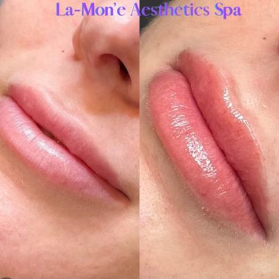

# Lip Filler Appointments in Bryn Mawr PA for First-Time Patients

Your first lip filler appointment can bring two competing wishes: you want a visible improvement, and you still want to recognize your own face. A useful plan starts with what you want to change, rather than a preset amount of filler.

At La-Mon’e Aesthetics in Bryn Mawr, PA, the published treatment menu gives first-time patients a way to compare lip enhancement with other injectable options. Here is what to understand before booking, what happens during treatment, and how to judge the result after swelling settles.

## What Can Lip Filler Change?

Lip filler adds volume and can help shape the lips or improve some differences between the upper and lower lip. Most lip fillers use hyaluronic acid, a substance that holds water.

You might want a little more fullness, clearer definition, or to restore volume you feel you have lost. These goals call for different discussions, even when they lead to the same general treatment.

La-Mon’e's [lip filler service](https://www.lamoneaesthetics.com/lip-filler-bryn-mawr-pa/) describes shape, size, and symmetry as treatment goals. That makes a specific concern, such as an upper lip that looks thin at rest, a better starting point than simply asking for larger lips.

Filler is not a promise of perfect symmetry. Your anatomy, the selected product, and how your tissues respond all affect the outcome.

## How Do You Explain the Result You Want?

Describe what bothers you and what you want to preserve. For example, you may want more upper-lip definition without a large change in overall size.

Bring reference photos if they help explain your preference, but use them as conversation tools. Another person's lip shape is not a template that an injector can reliably reproduce on your face.

La-Mon’e's [patient gallery](https://www.lamoneaesthetics.com/gallery/) includes paired lip photographs. They offer a more relevant starting point than an unrelated social-media image because you can ask the practice about its own published work.

*Caption: Paired lip photographs published in La-Mon’e Aesthetics' filler gallery. The source does not state the product, amount, photo timing, or recovery stage; this example does not predict another patient's result.*

In the example shown, the photographs focus closely on the lips. Ask which differences reflect treatment and whether swelling or photo conditions affected the appearance before drawing conclusions about size or shape.

You do not need to identify a favorite syringe amount before the consultation. Explain the visible change you want, and let the clinical assessment guide the proposed amount.

## What Is Distinctive About La-Mon’e's Approach?

Founder [La-Tasha Walker, BSN, RN, LC](https://www.lamoneaesthetics.com/la-tasha-walker-bsn-rn-lc/), came to aesthetics through cosmetology and nursing. Her published biography emphasizes education, natural-looking results, and inclusive care, especially for skin of color.

That background gives you specific subjects to discuss: preserving the features you value, reviewing examples relevant to your appearance, and understanding the proposed treatment before deciding. It does not guarantee a result or establish that every appointment is with La-Tasha.

The practice's about page identifies Dr. Glenn Rosen as medical director. When booking, confirm who will assess and inject your lips so you understand the clinician's role and can ask about relevant experience.

## What Should You Discuss Before Injections?

The consultation should cover your health history as well as your appearance goals. Share allergies, medicines, supplements, previous fillers, and any reactions to earlier cosmetic treatments.

Mention cold sores or an active infection around the mouth. Also tell the clinician if you are pregnant or breastfeeding, because safety and suitability need careful consideration.

Useful questions include:

- Which product is proposed, and why does it fit my goal?
- Is that product approved for use in the lips?
- What are the likely benefits and the important risks?
- How do I contact the practice if I have a concern afterward?

The [FDA's patient guidance](https://www.fda.gov/medical-devices/aesthetic-cosmetic-devices/dermal-fillers-soft-tissue-fillers) treats filler injection as a medical procedure and recommends discussing the specific product and injection site. Approval of a brand does not mean every product in that brand is approved for every area.

Do not stop prescribed medicines to reduce bruising without advice from the clinician who manages them. A complete history is more useful than trying to prepare through generic online instructions.

## What Happens During the Appointment?

The clinician assesses the lips and discusses the treatment before injecting. Numbing may help with comfort, but a brief pinch, pressure, or tenderness can still occur.

The product is placed in selected areas to address the agreed goal. The injection itself is only one part of the appointment; assessment, preparation, and aftercare discussion also need time.

Ask how the proposed placement supports the shape you discussed. Understanding the plan can help you distinguish an intentional change from a concern that needs follow-up.

Before leaving, make sure you have aftercare instructions and a contact route. You should know which changes are expected and which need prompt attention.

## How Much Does the First Appointment Cost?

La-Mon’e's [injectables menu](https://www.lamoneaesthetics.com/injectables-bryn-mawr-pa/) lists lip filler at $750–$1,000. Confirm the current quote, selected product, and what the appointment includes before treatment.

The same menu lists filler dissolving separately, starting at $350, and notes that more than one session may be needed. Do not assume an adjustment or dissolving visit is included in the initial price.

Those are different decisions: buying lip enhancement and arranging treatment to change existing filler. Ask about the relevant terms before committing, rather than relying on reversibility as a promise of a simple reset.

## When Can You Judge the Result?

You may see added volume right away, but the first appearance includes swelling. Bruising, tenderness, and temporary unevenness can complicate that early picture.

La-Mon’e's service page places the settled result within the following couple of weeks. Avoid treating a same-day photo as proof of your final size or shape.

The [American Society of Plastic Surgeons](https://www.plasticsurgery.org/cosmetic-procedures/dermal-fillers/recovery) explains that recovery varies and recommends discussing your individual plan. Follow your clinician's instructions about exercise, alcohol, lip products, and pressure on the area. Schedule treatment with room for recovery before an important event.

Hyaluronic acid filler is temporary, and duration varies by product and person. Ask when to review your result and how to decide whether maintenance would be useful; do not book repeated injections solely by the calendar.

## What If You Want an Adjustment?

First distinguish a concern about appearance from a possible complication. A routine discussion of shape can wait for an agreed review, but concerning symptoms need prompt assessment.

If the settled result is not what you expected, describe the specific issue: too much fullness, a shape you dislike, or a persistent lump. Ask what observation, adjustment, or dissolving would involve rather than assuming another injection is the answer.

Keep the name of the product and the date of treatment. Those details help a clinician assess your options if you later seek care elsewhere.

## Which Symptoms Need Urgent Attention?

Ordinary swelling does not make every symptom normal. Filler can rarely block a blood vessel, causing serious tissue injury or vision problems.

Seek immediate medical attention for unusual severe pain, white, gray, or blue skin near an injection, vision changes, or stroke symptoms. Do not wait for a routine follow-up if those occur.

Dissolving may be an option for some hyaluronic acid filler concerns, but it is a medical treatment with its own considerations. It does not make injections risk-free.

## Book Your First Lip Filler Consultation

La-Mon’e Aesthetics is at 819 Glenbrook Ave. in Bryn Mawr, outside Philadelphia. Bring your goals, previous treatment details, and questions about the published lip examples.

[Contact the practice](https://www.lamoneaesthetics.com/contact/) or call 484-344-1261 to arrange a consultation and confirm the right appointment before deciding on treatment.
