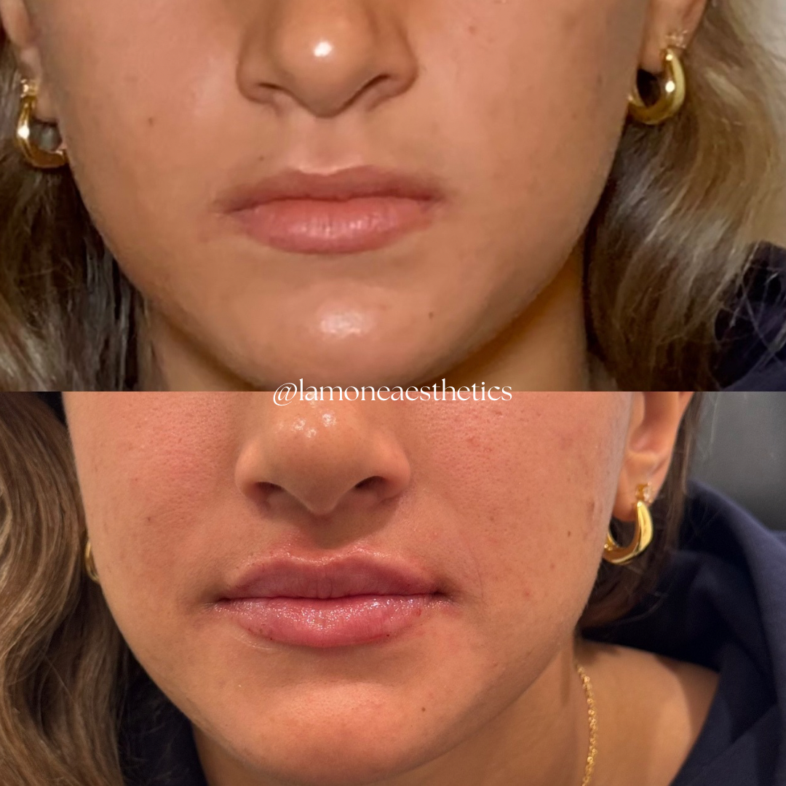

# Lip Filler Appointments in Bryn Mawr PA for First-Time Patients

A first lip-filler appointment is about deciding what kind of change would suit you, not simply how much volume to add. Fuller lips, a clearer outline, and better balance between the upper and lower lip are related goals, but they are not identical.

At La-Mon’e Aesthetics in Bryn Mawr, PA, [lip filler treatment](https://www.lamoneaesthetics.com/lip-filler-bryn-mawr-pa/) can address volume, shape, and asymmetry. Understanding the intended result, recovery, and financial commitment gives you a better basis for deciding whether to proceed.

## What Can Lip Filler Change?

Hyaluronic acid filler adds volume to the lips. The treatment can also change their outline and proportions, depending on where the product is placed. That makes the goal more specific than wanting lips that are simply “bigger.”

You might like the size of your lower lip but want more definition in the upper one. Or you may want a modest increase in fullness while keeping your familiar shape. These are useful distinctions for treatment planning because they describe the result you want to see in your own face.

La-Mon’e also offers a lip flip, which changes upper-lip movement through a muscle-relaxing injection rather than adding filler. It is a different approach, not another name for a small filler treatment. Whether it fits your concern depends on an assessment of your lips and how they move.

A consultation should connect your goal with a proposed change, including what treatment cannot reasonably achieve. The relevant question is not whether the practice can inject filler, but whether the explanation of the planned result makes sense to you.

## What Can La-Mon’e's Treatment Examples Show You?

La-Mon’e's [lip treatment gallery](https://www.lamoneaesthetics.com/gallery/) gives the discussion a concrete starting point. In the example below, the paired photographs show a visible change in fullness and in the upper-lip outline. Those are two features you can consider separately when thinking about your own goal.

*Caption: Fuller lips and a more defined upper-lip outline in a La-Mon’e treatment example. Individual results vary.*

The value of this example is the detail of the change, not the idea that another person's result can be reproduced for you. You may prefer the added definition while wanting less fullness, or feel that the balance between the lips is the more important feature.

Photographs are only part of that assessment. They cannot establish how a different face will respond or replace an examination. Use them to make the desired change clearer, while leaving the treatment amount and approach to a plan grounded in your own anatomy.

## What Should the Consultation Establish?

The consultation should leave you understanding the proposed product, the change being attempted, and the reasons for that plan. An explanation of placement and amount is more useful than a promise of a “natural” result without saying what that means.

The clinician also needs relevant health information, including allergies, previous fillers, and a history of cold sores. These details help determine whether treatment is appropriate and whether preparation needs to change. Do not treat the medical discussion as a formality before the cosmetic part begins.

La-Mon’e was founded by La-Tasha Walker, a registered nurse whose background includes nursing and aesthetics. Dr. Glenn Rosen serves as medical director. Those roles provide context for the practice, while the appointment should establish which clinician will assess and treat you.

A first consultation is also the time to understand how concerns after treatment are handled. Clarify the review arrangements and how to contact the team. A treatment decision is easier to make when you know what happens after you leave, as well as what happens during the injections.

## What Happens During Treatment?

The appointment generally includes assessment, cleansing, numbing, and injections, with the clinician evaluating the change as treatment proceeds. La-Mon’e uses numbing for lip filler, but pressure or a pinch may still be noticeable. Comfort measures do not make the procedure sensation-free.

The [American Society of Plastic Surgeons' procedure overview](https://www.plasticsurgery.org/cosmetic-procedures/dermal-fillers/procedure) explains how assessment and evaluation fit into filler treatment. The injection itself is only one part of the appointment. Leave time for the discussion and aftercare instructions rather than plan around the shortest possible treatment estimate.

You may see increased fullness immediately, but that first appearance is not the settled result. Swelling can temporarily make the lips look larger than intended. La-Mon’e advises allowing a couple of weeks for the final appearance to emerge.

Reviewing the settled result is also different from deciding on another injection. If you want an adjustment, first establish whether the concern is persistent or part of recovery. Additional treatment should have its own explanation rather than be an automatic response to the earliest appearance.

That distinction matters if you are having treatment before an event. Choose timing that leaves room for recovery and assessment, rather than expect the lips to look finished as soon as you leave. Follow the clinician's aftercare instructions and clarify any restrictions that affect your plans.

## What Risks Should You Understand?

Lip filler is a medical procedure with risks, even when the desired change is small. Swelling, bruising, tenderness, and pain can occur. These effects need to be considered alongside the result you hope to achieve.

The [FDA's filler safety guidance](https://www.fda.gov/medical-devices/aesthetic-cosmetic-devices/dermal-fillers-soft-tissue-fillers) also explains the rare but serious risk of injection into a blood vessel. Complications can include tissue damage and vision loss. Appropriate training and a plan for managing complications matter more than treating filler as a routine beauty purchase.

Seek immediate medical attention for unusual pain, vision changes, or white, gray, or blue skin near an injection site during or shortly after treatment. Do not assume those signs are ordinary swelling that should simply settle.

Before proceeding, understand the risks of the specific product and how the team will respond to a concern. A reassuring consultation should make those answers clearer, not avoid them. Deciding to wait is reasonable if you do not yet understand the recommendation or its limits.

## What Does the Financial and Appointment Commitment Include?

La-Mon’e's [injectable treatment pricing](https://www.lamoneaesthetics.com/injectables-bryn-mawr-pa/) puts lip filler at $750 to $1,000. Confirm the current quote and what it includes before treatment. The final plan should connect the proposed amount and result with the price, rather than leave you comparing an unexplained range.

The practice also offers filler dissolving, starting at $350, with the cost depending on the treatment needed. Correction is therefore not necessarily included in the original purchase. Removal carries its own risks, and the possibility of dissolving filler does not make the original decision consequence-free.

Filler is temporary, so maintaining a result can involve future appointments and expense. La-Mon’e gives a broad six- to 18-month estimate for lip-filler longevity; your product, treatment, and response affect that timing. Consider maintenance without assuming that every patient returns on the same schedule.

La-Mon’e's [appointment policies](https://www.lamoneaesthetics.com/about-us/) require a nonrefundable booking deposit and 48 hours' notice for cancellation or rescheduling. Extra guests and children cannot attend unless they are receiving a service. Those details affect both your calendar and the commitment you make when reserving a visit.

## Plan Your First Appointment in Bryn Mawr

A good first appointment connects a specific goal with a clear treatment explanation, realistic recovery, and a commitment you understand. You do not need to arrive knowing the right amount of filler; you should leave knowing why the proposed plan fits your concern.

[Contact La-Mon’e Aesthetics in Bryn Mawr](https://www.lamoneaesthetics.com/contact/) to arrange a lip-filler consultation and discuss the result, current price, and appointment details before booking treatment.
